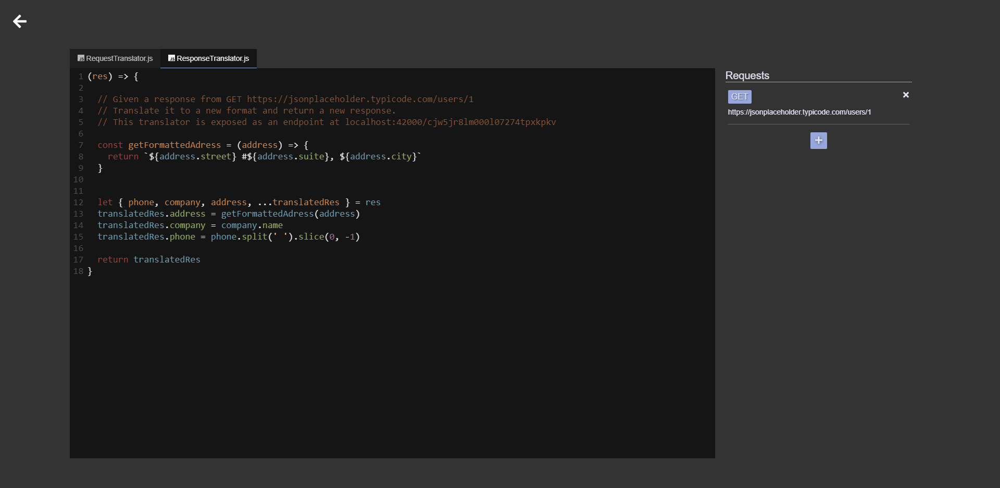

# Middleman
API Translator as a Service




### Install
```
./middleman install
```

### Build docker images
```
./middleman build
```

### Start backend services
```
./middleman start
```

### Run client
```
cd client
yarn
yarn serve
```

### Run migrations
Modify `api/prisma/datamodel.prisma`
```
./middleman migrate
```

### Create db backup
```
./middleman backup
```

### Restore db from backup
```
./middleman restore [filename].sql
```

